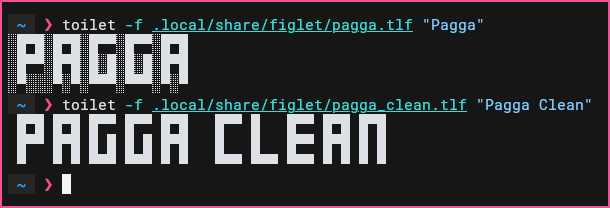

# Pagga Clean

A cleaned version of the Pagga FIGlet/TOIlet font without the noisy `░` background

## Preview



## Installation

```bash
git clone https://github.com/leonardoagodoy/pagga-clean
cd pagga-clean
mkdir -p ~/.local/share/figlet
cp pagga_clean.tlf ~/.local/share/figlet/
```

## Usage

```bash
toilet -f pagga_clean.tlf "Hello"
```

## Why?

The original Pagga font uses a heavy `░` background pattern
This version removes that background while preserving the original shape and spacing

## Credits

Original font belongs to its respective [creator](https://github.com/xero/figlet-fonts/blob/main/pagga.tlf).
This repository only provides a cleaned variant.
